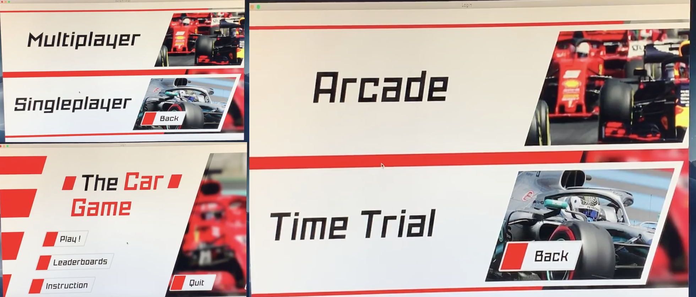
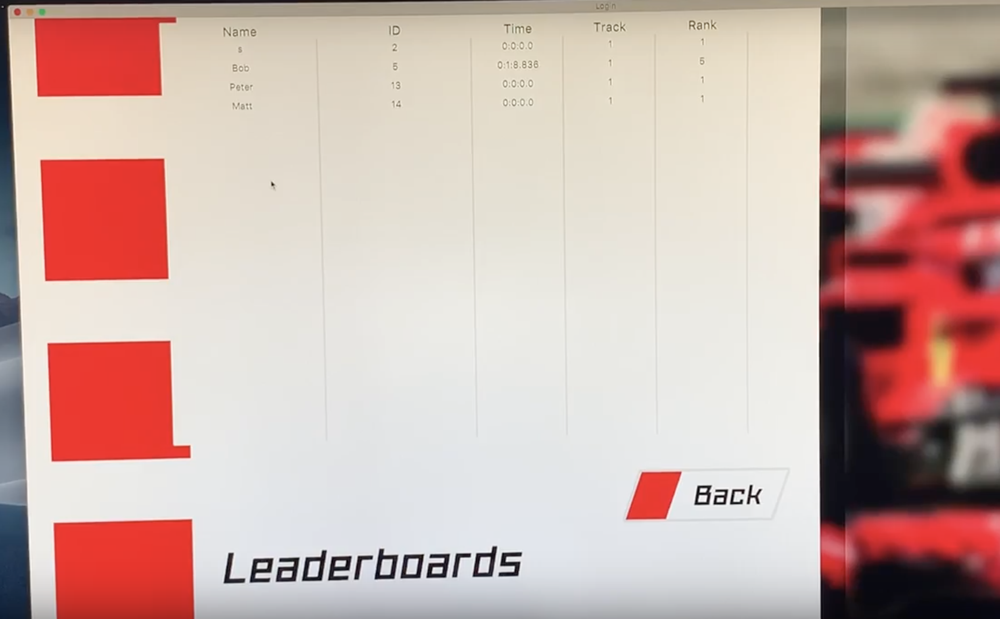
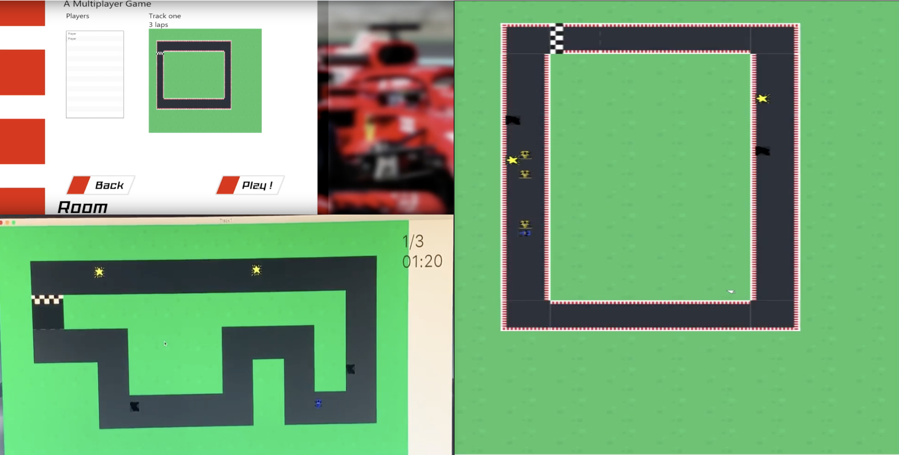
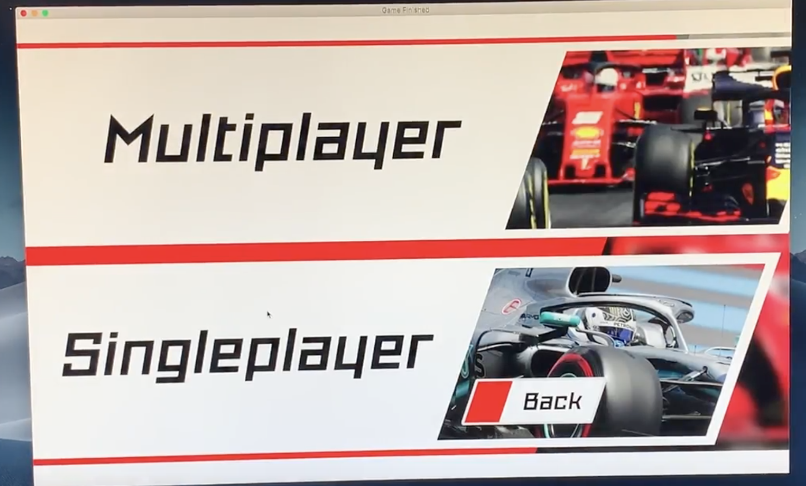
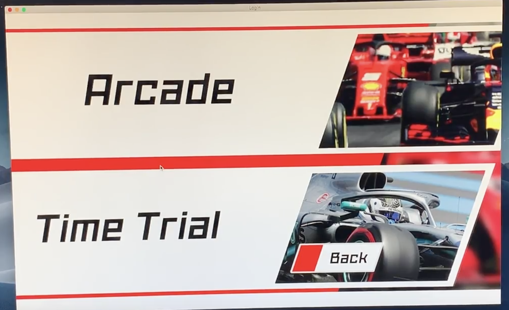
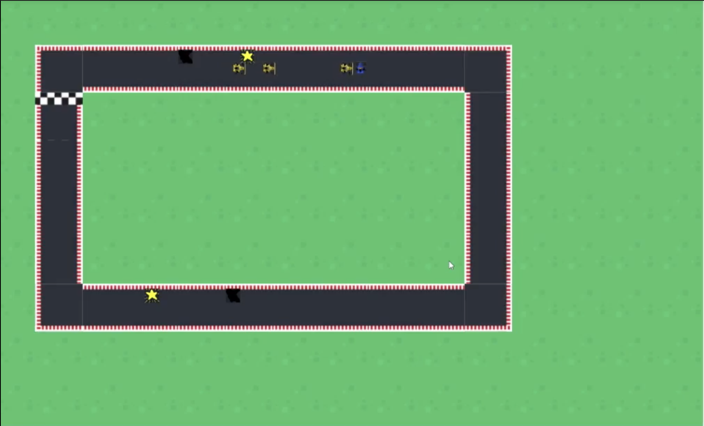
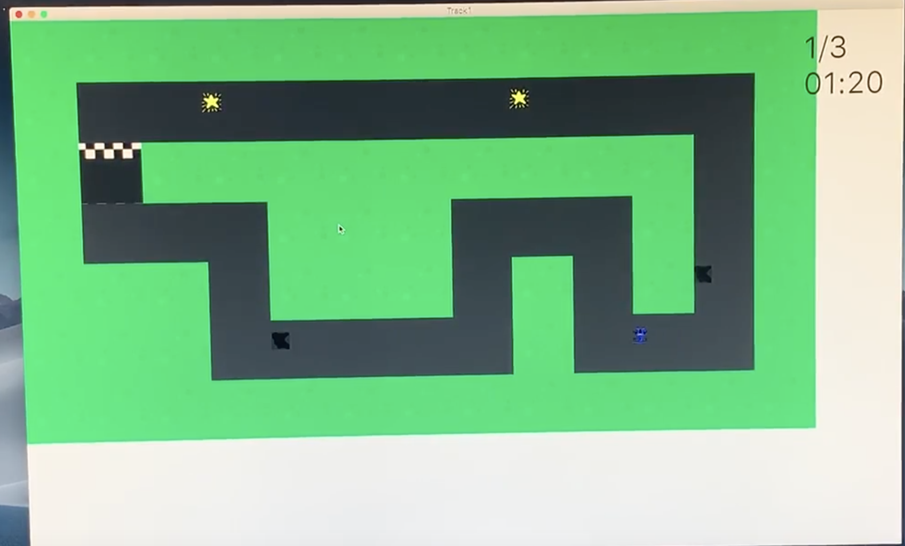

# Car Racing Game

This game is developed following software design principles. It has different components including AI, Database, Physics, Camera, Multiplayer and Single player mode and others. 

- AI is one player which figures out its root and avoid obstacles to be competent withe real human player
- Database is used to store user details, leader board time and other data
- Physics component of the game allows the car decelerate and accelerate  during race
- Server is also another component of the game which allows more than one player can participate. 
  It uses client - server communication which uses local device as server
- Camera also used to display the track as player moves different track sections. 

## Server and Database Requirements

- MySQL server running with username/password configured in DatabaseControl.java before artifacts are built
- database.sql ran on the MySQL server

## Running the server

1. Double-click on out/artifacts/TCG_Server/server_start.bat

## Running the client

1. Run out/artifacts/TCG_Client

## The sample User Interface(UI) of the application
- The home page which  has instructions for player, leaderboard for checking past and present records,
- The single player track options as Time trial and Archade,
- And other important UI components to play the game are shown as snapshoot of the app

<!--  -->

- The games UI component has also Room to display player lists and the preview of tracks
- Multiplayer tracks randomly generated and camera based track
- Powerups and oils as reward and other components of UI are shown below as sample snapshoot of the app

<!-- 

 -->
