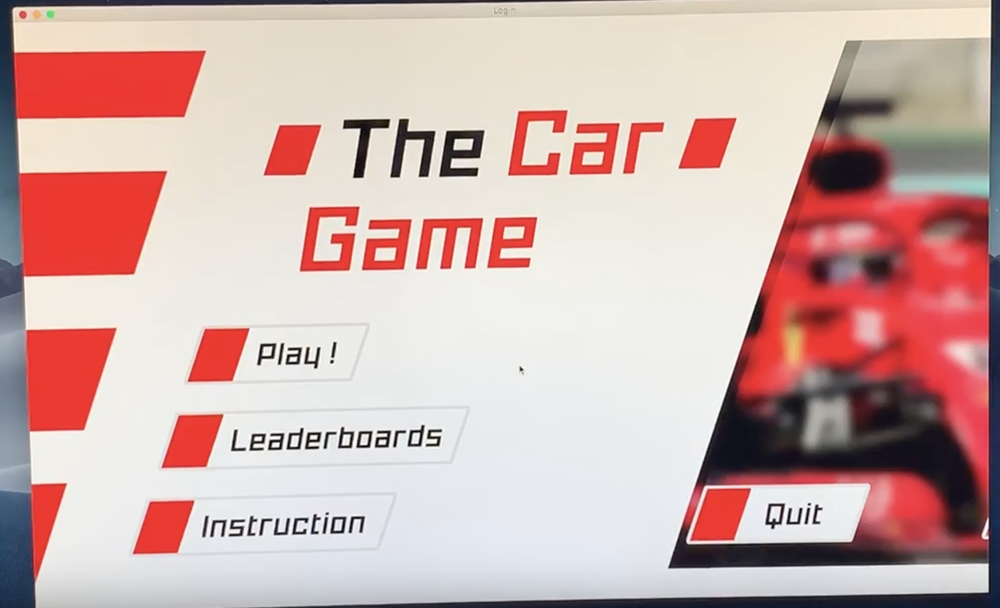
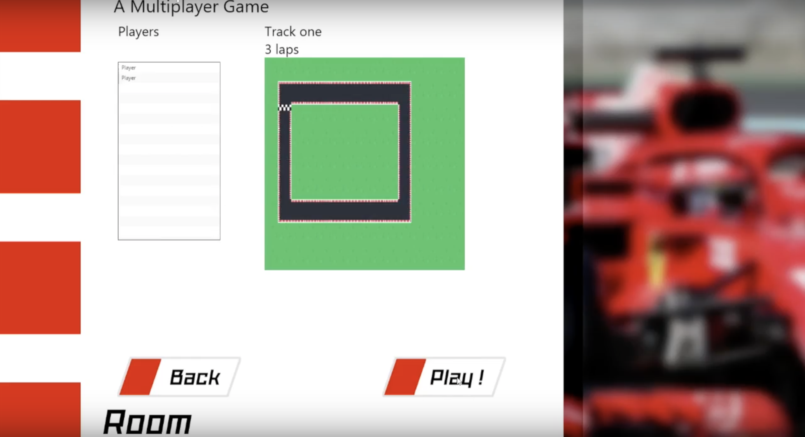

**Server and Database Requirements**

- MySQL server running with username/password configured in DatabaseControl.java before artifacts are built
- database.sql ran on the MySQL server

**Running the server**

1. Double-click on out/artifacts/TCG_Server/server_start.bat

**Running the client**

1. Run out/artifacts/TCG_Client

The project has multiple components
such as 
1. Single player
2. Multiple player
3. AI
4. Database and server
5. Camera
6. power ups and oil to speed up and reduce car speed. 

Sample output of the application

homePage.png
leader_board.png
multi_player_room.png
multi_player_single_player_selector.png
single_payer_options.png
singlePlayer.png
AI_and_real_person_playing.png